# PR0301: Facturas con Odoo
### Introduce los datos de tu empresa. Será una empresa de venta de material informático y podrás inventarte todos los datos, salvo el nombre que será {iniciales} Computers donde {iniciales} son las iniciales de tu nombre.
1. En el menú "Clientes", accedemos a Clientes.<br>
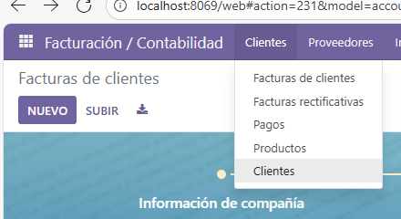
2. Creamos un nuevo cliente.<br>

3. Introducimos datos de la empresa (en mi caso, se llamará ARF Computers). Pulsamos "Añadir" para crear el cliente.<br>
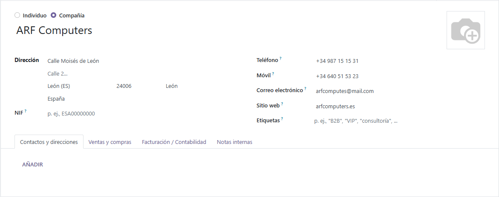
4. Creamos el contacto.<br>
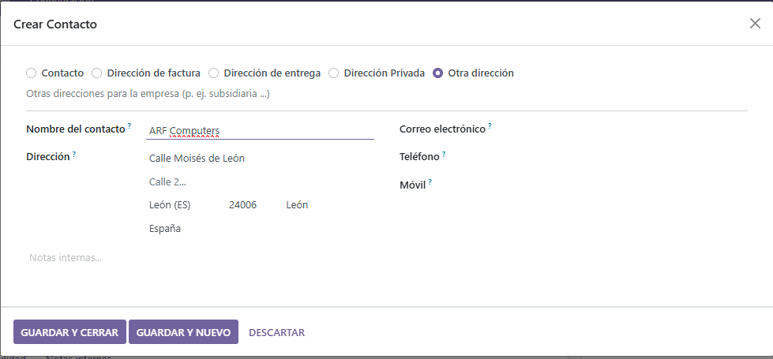
5. El cliente (Empresa) ya se habría creado con éxito<br>

### Crea un segundo usuario que tendrá permiso únicamente para acceder al módulo de Facturación.
1. Accedemos a los ajustes.<br>
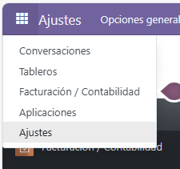
2. Entramos en "Gestionar usuarios"<br>
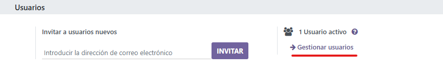
3. Creamos un nuevo usuario.<br>
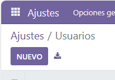
4. Escribimos el nombre y una dirección<br>
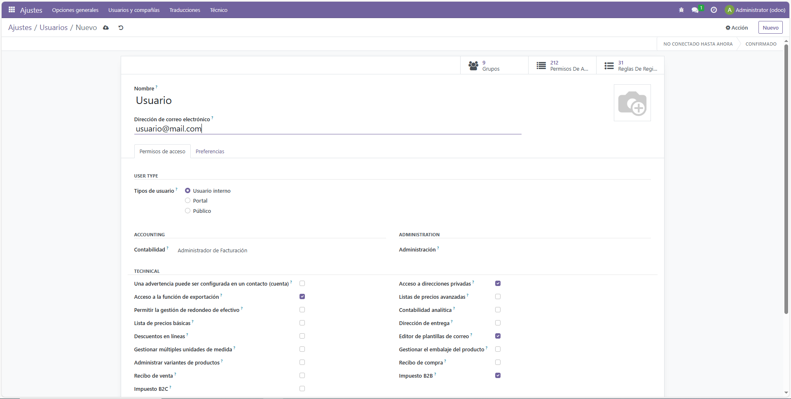
5. En el apartado "Accounting", damos permisos de acceso al apartado Facturación
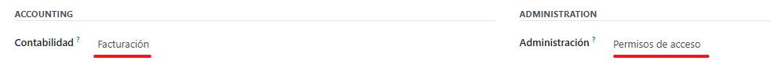
### Configura la apariencia de las facturas con las siguientes características:
- Cambia los colores por defecto del encabezado y del botón
- Añade un logotipo de la empresa y una imagen de fondo en las facturas
- Agrega QR de pago a las facturas

1. En el menú, entramos en el apartado "Facturación"<br>
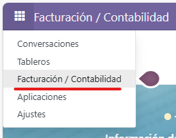
2. Accedemos al apartado de configuración<br>

3. Entramos en los ajustes<br>
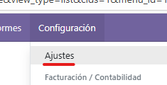
4. Accedemos a las opciones generales<br>
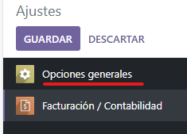
5. Ahí podremos cambiar los colores del encabezado y del botón<br>
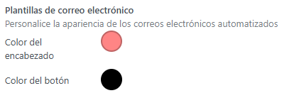
6. Guardamos los cambios<br>
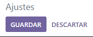
6. En "Diseño de Factura", hacemos click en "Personalizar".<br>
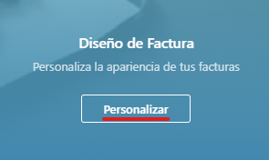
7. Ahí podremos cambiar el logo y el fondo de la factura<br>
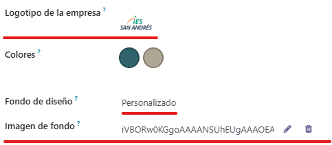
8. Guardamos cambios<br>
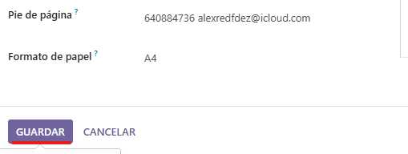
9. Así, habremos guardado los cambios en cada factura

10. Para añadir el QR de pago, accedemos a los ajustes de "Facturación"<br>
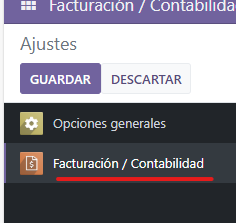
11. Marcamos la siguiente opción para activarlo<br>
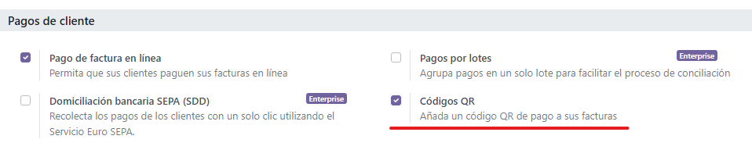
12. Guardamos los cambios
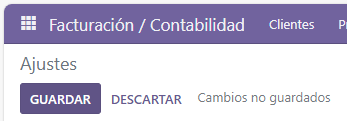
### Carga datos de los clientes. Estos datos se encuentran en el fichero clientes.csv
1. Accedemos al apartado "Clientes", dentro de "Facturación"<br>
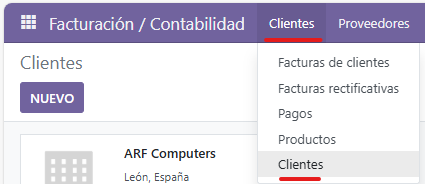
2. En el apartado "Favoritos", hacemos click en "Importar registros"<br>
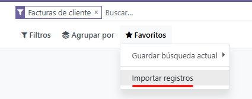
3. Hacemos click en "Subir archivos"<br>
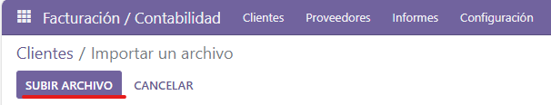
4. Subimos el archivo clientes.csv y referenciamos cada columna del csv a cada campo de Odoo<br>
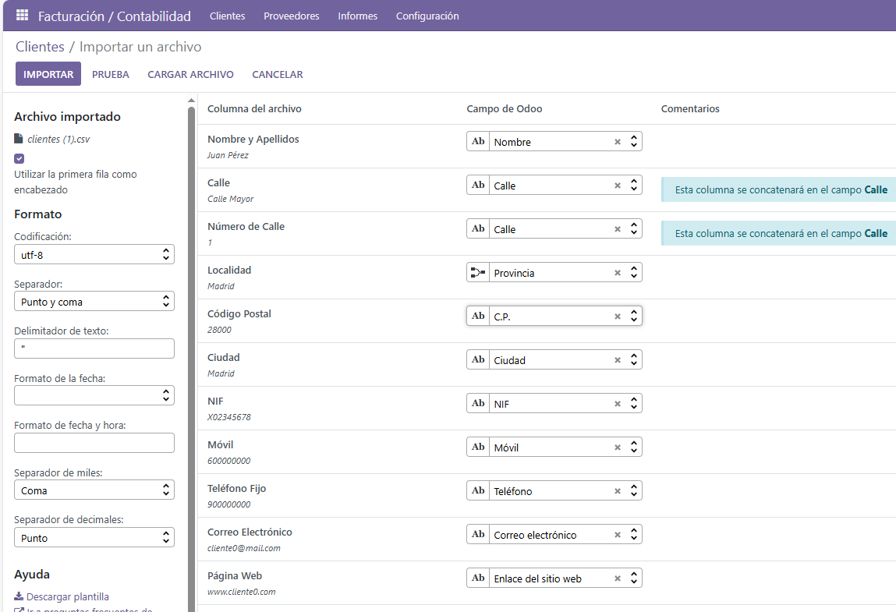
5. Hacemos click en "Importar"<br>
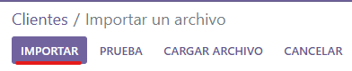
6. Ya se habrían importado todos los clientes con éxito
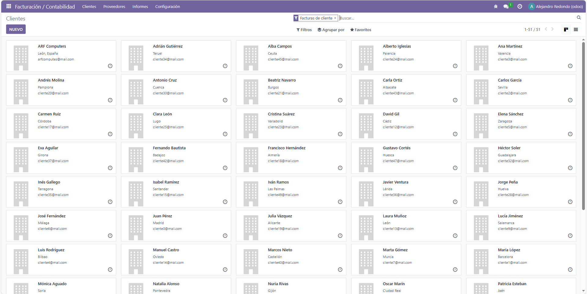
### Inicia sesión con el usuario que creaste al principio (puedes cerrar la sesión actual o usar otro navegador) y genera una factura de venta de un producto que tú quieras.
1. Desde otro navegador, accedemos a ```localhost:8069``` y metemos los datos de inicio de sesión.<br>
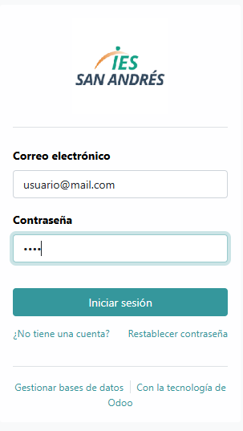
2. Vemos que con el usuario "Usuario", tenemos acceso al apartado de "Facturación"<br>
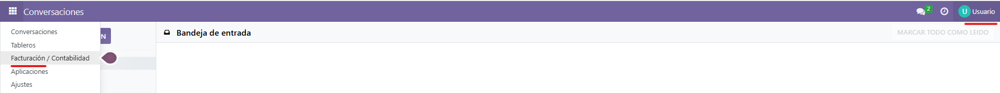<br>
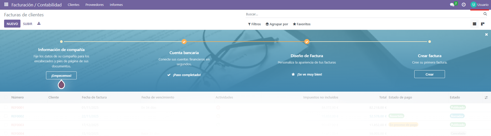<hr>
[Factura creada con Odoo](INV_2025_00001.pdf)