# PR0302: Integración de servicios externos
### Activa el módulo de Inventario
1. Accedemos al apartado "Aplicaciones"<br>
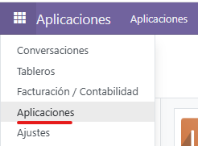
2. Buscamos la aplicación "Inventario" y hacemos click en "Activar"<br>
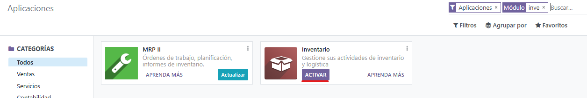
3. Ya podremos acceder al apartado "Inventario"<br>
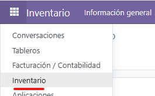
### Importa los productos del fichero Excel indicado en el apartado de recursos
1. Para importarlos, entramos en "Productos"<br>
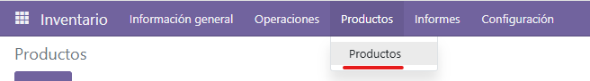
2. Hacemos click en "Importar registros" en el apartado de "Favoritos"<br>
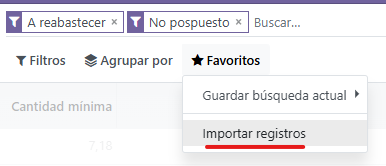
3. Referenciamos los campos del CSV con los campos de Odoo<br>
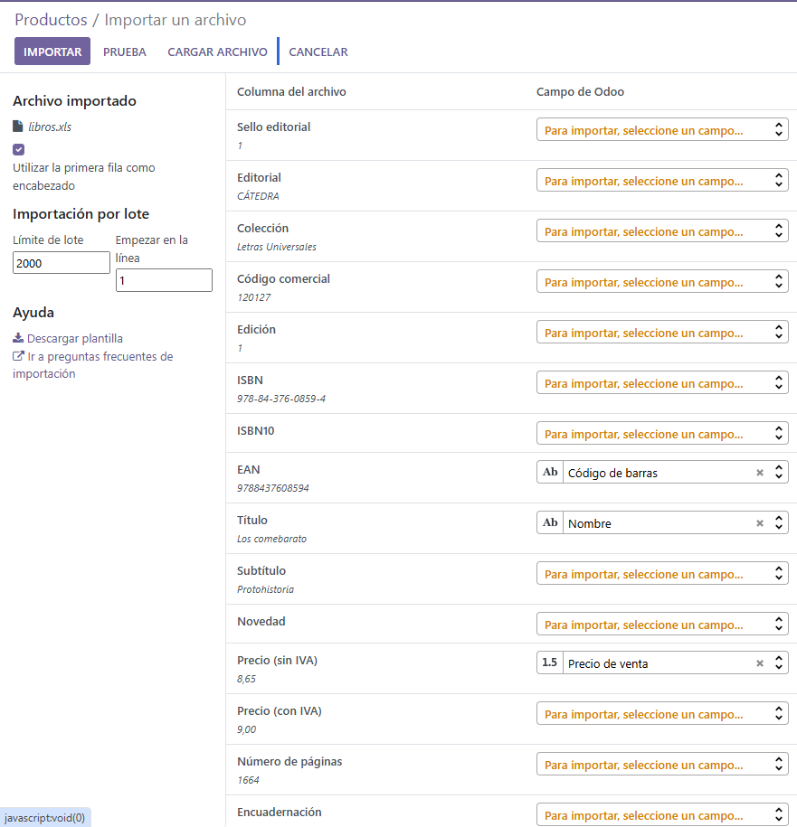
4. Ya se habrían importados los libros<br>
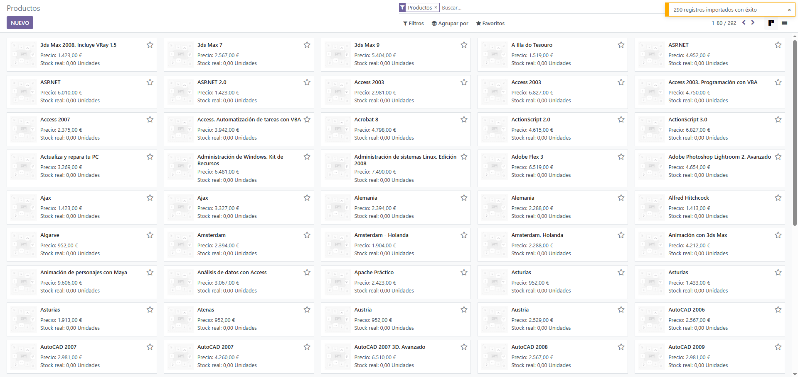
### Habilita la búsqueda en Google Images y comprueba que funciona con algunos de los productos que hayas importado (recuerda que tienes un límite de 100 búsquedas en la versión gratuita)
1. Accedemos a la siguiente página ```https://console.cloud.google.com/apis/dashboard``` y creamos un  proyecto.<br>
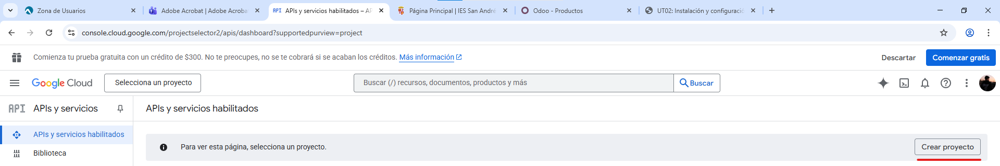
2. Una vez creado, accedemos al apartado "Credenciales"<br>
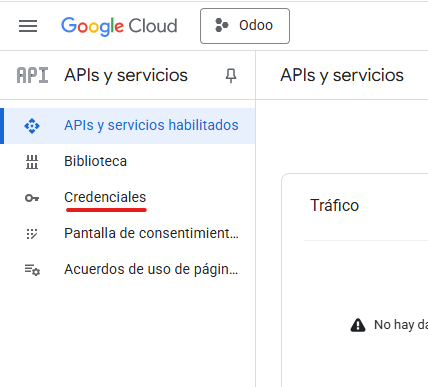
3. Nos dirigimos a "Crear credenciales" y seleccionamos "Clave de API".<br>
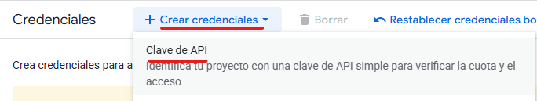
4. Hacemos click en "Crear", para crear un API Key.<br>
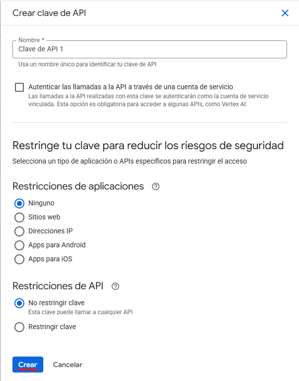
5. Ya habríamos creado una API Key.<br>
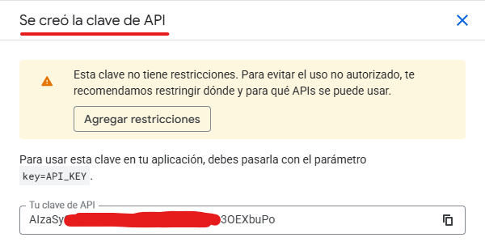
6. Ahora, volvemos a entrar en "Biblioteca".<br>
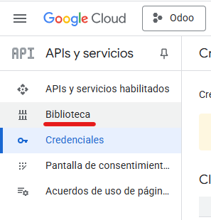
7. En el buscador, buscamos "Custom Search API"
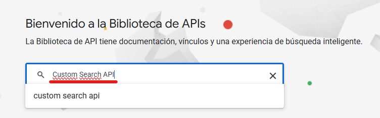
8. Seleccionamos la siguiente y la habilitamos:
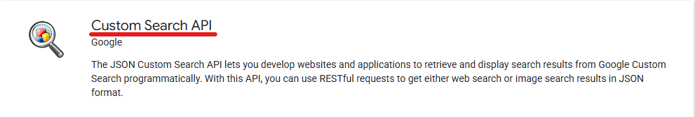
9. Ahora, vamos a la siguiente página ```https://programmablesearchengine.google.com/```. Hacemos click en "Get started"<br>
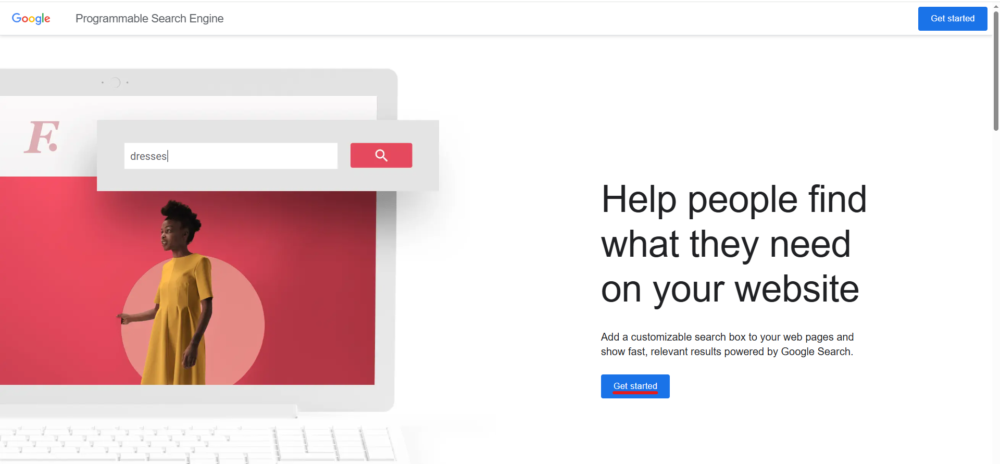
10. Configuramos un nombre y habilitamos "Búsqueda de imágenes" y "Búsqueda segura". También habilitamos "Buscar en toda al Web".
Hacemos click en "Crear"<br>
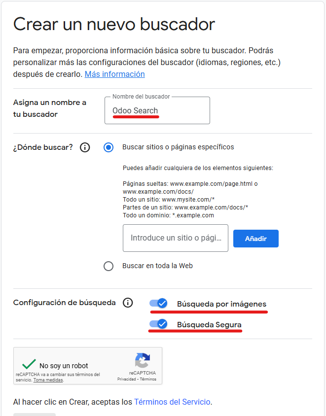
11. Ya estaría creado. Ahora, hacemos click en "Personalizar"<br>
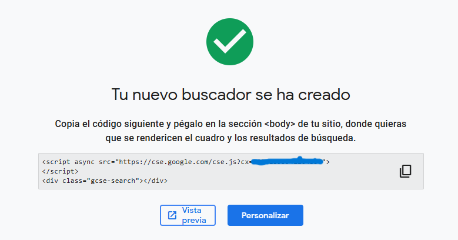
12. Copiamos el ID del buscador ya que lo necesitaremos para Odoo, junto al API Key<br>
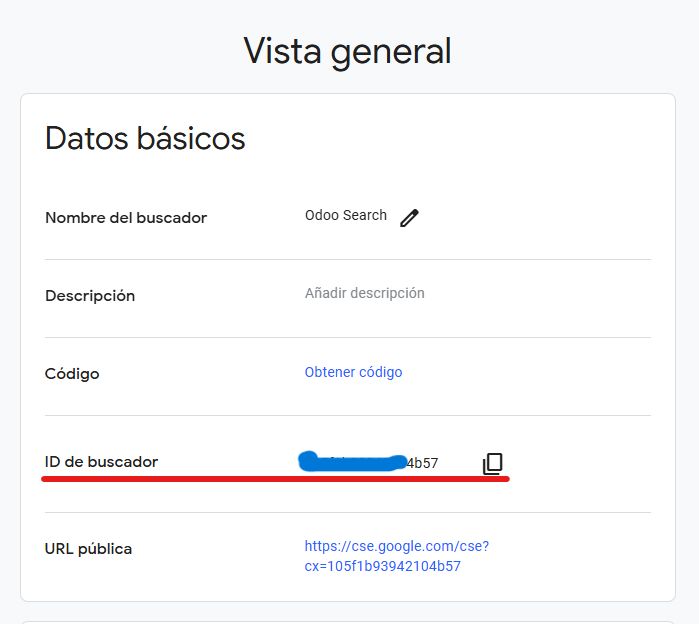
13. Volvemos a Odoo, entramos en la configuración.<br>
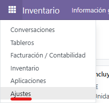
14. Entramos en las opciones generales<br>
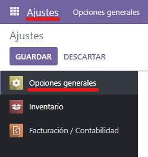
15. Activamos "Google Imágenes", en el apartado de "Integraciones". Guardamos los cambios.<br> 
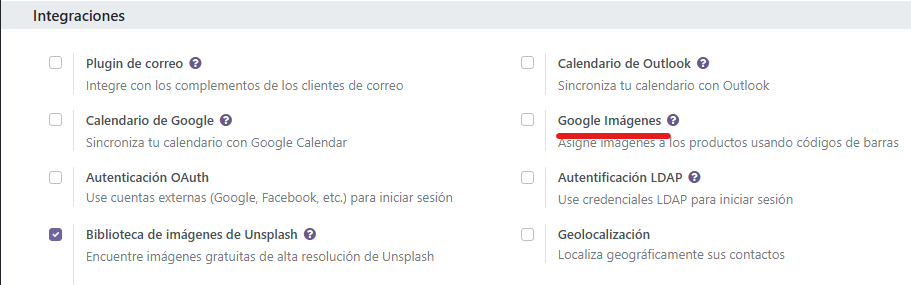
16. Ahora, metemos la API Key (encontrada en ```https://console.cloud.google.com/apis/dashboard```) y la ID de buscador (encontrada en ```https://programmablesearchengine.google.com/```).<br>
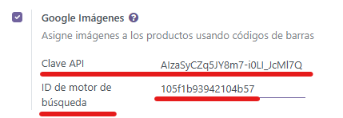<br>
Guardamos los cambios.
17. Ahora, volvemos al "Inventario" para establecer las imágenes con Google Imagenes.<br>
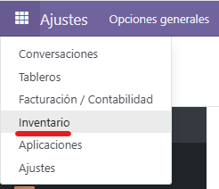
18. Entramos a "Productos".<br>
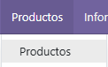
19. Ahora, al seleccionar algún productos, nos dejará obtener la imagen del producto automáticamente mediante Google Imagenes.<br>
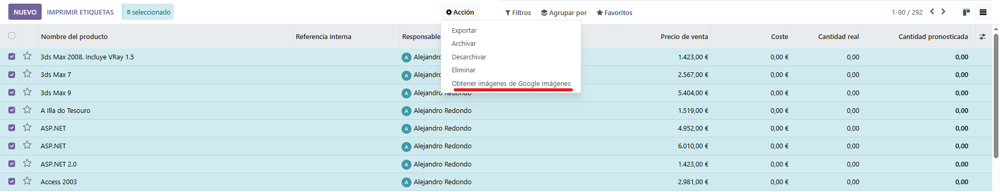
20. Al pulsar, nos saldrá este mensaje, avisando de cuántos productos serán cambiados. Pulsamos en "Obtener imagenes".<br>
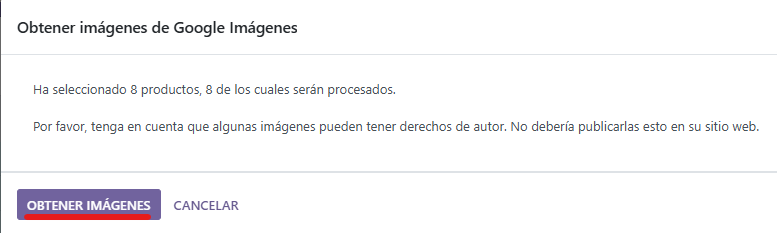
21. En mi caso, solo 4 imágenes de productos fueron encontradas.<br>

22. Esos productos ya tienen imagen.<br>
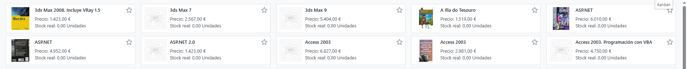