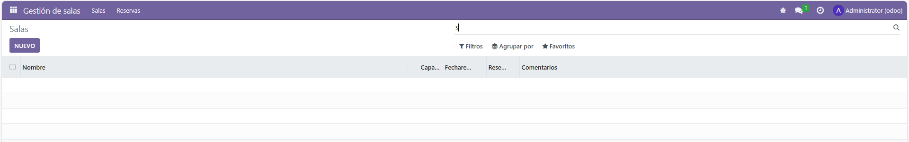

# PR0501: Creación de un módulo básico

### El objetivo de esta práctica es crear un módulo en Odoo que gestione reservas de salas en una empresa.

Cada reserva tendrá los siguientes campos:
- Nombre de la Sala, de tipo texto.
- Capacidad, de tipo entero.
- Fecha de Reserva, de tipo fecha.
- Reservada, de tipo booleano, indicará si está disponible o no.
- Comentarios de tipo texto.

El módulo incluirá un sistema de menús con tres niveles. Los menús tendrán la siguiente estructura:

```
Gestión de salas
   |
   |-- Salas
   |     |
   |     |--Salas Disponibles
   |
   |- Reservas
         |
         |- Reservas realizadas (este menú no tendrá acción asociada)
```

1. Accedemos al contenedor de Odoo<br>

`docker exec -it 97b3 bash`

2. Con Scaffold, creamos un nuevo módulo.<br>

`odoo scaffold gestion_salas`

3. Después, configuramos el manifest, descomentando la Security y comentando Templates.<br>

```python
'data': [
        'security/ir.model.access.csv',
        'views/views.xml',
        #'views/templates.xml',
    ],
```

4. Después, configuramos los Models, creando cada campo que la práctica pide..<br>

```python
from odoo import models, fields, api


class gestion_salas(models.Model):
    _name = 'gestion_salas.sala'
    _description = 'gestion_salas.gestion_salas'

    nombre = fields.Char()
    capacidad = fields.Integer()
    fechareserva = fields.Date()
    reservada = fields.Boolean()
    comentarios = fields.Text()
```

5. Una vez configuradas los Models, pasamos a configurar las Views<br>´

```xml
<odoo>
  <data>
    <record model="ir.ui.view" id="gestion_salas.list">
      <field name="name">gestion_salas list</field>
      <field name="model">gestion_salas.sala</field>
      <field name="arch" type="xml">
      <!-- Campos del Model -->
        <tree>
            <field name="nombre"/>
            <field name="capacidad"/>
            <field name="fechareserva"/> 
            <field name="reservada"/>
            <field name="comentarios"/>
          </tree>
      </field>
    </record>

    <record model="ir.actions.act_window" id="gestion_salas.action_window">
      <field name="name">Salas</field>
      <field name="res_model">gestion_salas.sala</field> <field name="view_mode">tree,form</field>
    </record>

    <!-- Creación de los menús -->
    <menuitem name="Gestión de salas" id="gestion_salas.menu_root"/>
    <!-- Creación de los submenús -->
    <menuitem name="Salas" id="gestion_salas.menu_1" parent="gestion_salas.menu_root"/>
    <menuitem name="Reservas" id="gestion_salas.menu_2" parent="gestion_salas.menu_root"/>
    <menuitem name="Salas disponibles" id="gestion_salas.menu_1_list" parent="gestion_salas.menu_1" action="gestion_salas.action_window"/>
    <menuitem name="Reservas realizadas" id="gestion_salas.menu_2_list" parent="gestion_salas.menu_2" action="gestion_salas.action_window"/>
    </data>
</odoo>
```

6. Después de esto, reiniciamos el contenedor y ya estaría configurado el módulo.<br>


