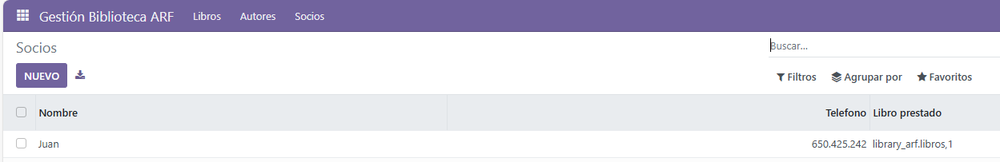

# PR0602: Campos relacionales

### Añadir los modelos

- `autores.py`

```python
from odoo import models, fields, api


class autores(models.Model):
    _name = 'library_arf.autores'
    _description = 'Módulo para los autores'

    nombre = fields.Char()
    pais = fields.Many2one('res.country')
    genero = fields.Selection([
                                ('novela', 'Novela'),
                                ('drama', 'Drama'),
                                ('cienciaficcion', 'Ciencia ficción'),
                                ('misterio', 'Misterio'),
                                ('terror', 'Terror'),
                                ('historico', 'Histórico')
                            ],String ='Género')
    libro_ids = fields.One2many(
        comodel_name  = 'library_arf.libros',
        inverse_name = 'autor_id',
        string = "Libros publicados"
    )
```

- `libros.py`

```python
from odoo import models, fields, api


class libros(models.Model):
    _name = 'library_arf.libros'
    _description = 'Módulo para los libros'

    titulo = fields.Char()
    autor = fields.Char()
    genero = fields.Selection([
                                ('novela', 'Novela'),
                                ('drama', 'Drama'),
                                ('cienciaficcion', 'Ciencia ficción'),
                                ('misterio', 'Misterio'),
                                ('terror', 'Terror'),
                                ('historico', 'Histórico')
                            ],String ='Género')
    socios_ids = fields.One2many(
        comodel_name='library_arf.socios',
        inverse_name='libro_prestado_id',
        string='Socios prestados'
    )
    autor_id = fields.Many2one(
        comodel_name = 'library_arf.autores',
        string = 'Autor',
        required=True
    )
```

- `socios.py`

```python
from odoo import models, fields, api


class socios(models.Model):
    _name = 'library_arf.socios'
    _description = 'Módulo para los socios'

    nombre = fields.Char()
    telefono = fields.Integer()
    libro_prestado_id = fields.Many2one(
        comodel_name='library_arf.libros',
        string='Libro prestado'
    )
```

### Añadir las views

- `library_author_views.xml`

```xml
<odoo>
    <data>
        <record model="ir.ui.view" id="library_arf_autores_tree_view">
            <field name="name">library_arf.autores.tree</field>
            <field name="model">library_arf.autores</field>
            <field name="arch" type="xml">
                <tree string="Listado de Autores">
                    <field name="nombre"/>
                    <field name="pais"/>
                    <field name="genero"/>
                </tree>
            </field>
        </record>
    </data>
</odoo>
```

- `library_book_views.xml`

```xml
<odoo>
    <data>
        <record model="ir.ui.view" id="library_arf_libros_tree_view">
            <field name="name">library_arf.libros.tree</field>
            <field name="model">library_arf.libros</field>
            <field name="arch" type="xml">
                <tree string="Listado de Libros">
                    <field name="titulo"/>
                    <field name="autor_id"/>
                    <field name="genero"/>
                </tree>
            </field>
        </record>
    </data>
</odoo>
```

- `library_socio_views.xml`

```xml
<odoo>
    <data>
        <record model="ir.ui.view" id="library_arf_socios_tree_view">
            <field name="name">library_arf.socios.tree</field>
            <field name="model">library_arf.socios</field>
            <field name="arch" type="xml">
                <tree string="Listado de Socios">
                    <field name="nombre"/>
                    <field name="telefono"/>
                    <field name="libro_prestado_id"/>
                </tree>
            </field>
        </record>
    </data>
</odoo>
```

### Importar los modelos

- `__init__.py`

```python
from . import autores
from . import libros
from . import socios
```

### Configurar `manifest.py` para cargar las views

```python
'data': [
        'security/ir.model.access.csv',
        #'views/views.xml',
        'views/library_menu_views.xml',
        'views/library_book_views.xml',
        'views/library_socio_views.xml',
        'views/library_author_views.xml',
        #'views/templates.xml',
    ],
```

### Configurar la seguridad de la aplicación

```csv
id,name,model_id:id,group_id:id,perm_read,perm_write,perm_create,perm_unlink
access_library_arf_libros,access.library.arf.libros,model_library_arf_libros,base.group_user,1,1,1,1
access_library_arf_autores,access.library.arf.autores,model_library_arf_autores,base.group_user,1,1,1,1
access_library_arf_socios,access.library.arf.socios,model_library_arf_socios,base.group_user,1,1,1,1
```

## Aplicación funcionando
<br>

