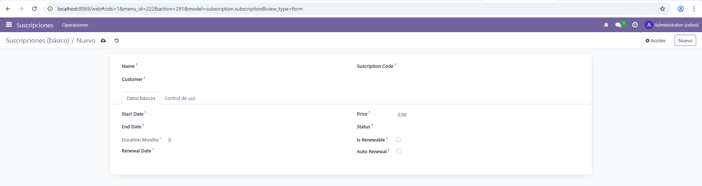

# PR0605: Vista de tipo formulario

Simplemente modificamos el `views.xml` de la página anterior, añadiendo la parte de formulario. Al hacer esto e intentar añadir una nueva subscripción o editar una, saldrá de esta forma

```xml
    <!-- Para el FORM -->
    <record id="view_subscription_form" model="ir.ui.view">
        <field name="name">subscription.form</field>
        <field name="model">subscription.subscription</field>
        <field name="arch" type="xml">
            <form string="Formulario de suscripción">
                <sheet>
                    <group>
                        <group>
                            <field name="name"/>
                            <field name="customer_id"/>
                        </group>
                        <group>
                            <field name="suscription_code"/>
                        </group>
                    </group>

                    <notebook>
                        
                        <page string="Datos básicos">
                            <group>
                                <group>
                                    <field name="start_date"/>
                                    <field name="end_date"/>
                                    <field name="duration_months"/>
                                    <field name="renewal_date"/>
                                </group>
                                <group>
                                    <field name="price"/>
                                    <field name="status"/>
                                    <field name="is_renewable"/>
                                    <field name="auto_renewal"/>
                                </group>
                            </group>
                        </page>

                        <page string="Control de uso">
                            <group>
                                <field name="usage_limit"/>
                                <field name="current_usage"/>
                                <field name="use_percent"/>
                            </group>
                        </page>

                    </notebook>
                </sheet>
            </form>
        </field>
    </record>
```

