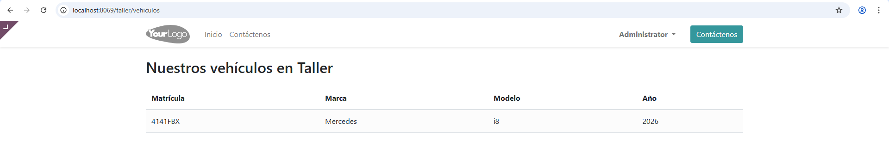

# PR0701: Página estática y dinámica básica

- `controllers\controllers.py`

```python
# -*- coding: utf-8 -*-
from odoo import http

class TallerController(http.Controller):

    @http.route('/taller/bienvenida', auth='public', website=True)
    def bienvenida(self, **kw):
        return "<h1>Bienvenido al taller mecánico</h1><p>Alejandro Redondo Fernández.</p>"

    @http.route('/taller/vehiculos', auth='public', website=True)
    def listado_vehiculos(self, **kw):
        vehiculos = http.request.env['taller_mecanico.vehiculo'].sudo().search([])
        
        return http.request.render('taller_mecanico.lista_vehiculos_template', {'vehiculos': vehiculos})
```

- `views\templates.xml`

```xml
<odoo>
    <template id="lista_vehiculos_template" name="Listado de Vehículos">
        <t t-call="website.layout">
            <div class="container mt-4">
                <h2 class="mb-4">Nuestros vehículos en Taller</h2>
                <table class="table table-striped">
                    <thead>
                        <tr>
                            <th>Matrícula</th>
                            <th>Marca</th>
                            <th>Modelo</th>
                            <th>Año</th>
                        </tr>
                    </thead>
                    <tbody>
                        <t t-foreach="vehiculos" t-as="v">
                            <tr>
                                <td><t t-esc="v.matricula"/></td>
                                <td><t t-esc="v.marca"/></td>
                                <td><t t-esc="v.modelo"/></td>
                                <td><t t-esc="v.anio"/></td>
                            </tr>
                        </t>
                    </tbody>
                </table>
            </div>
        </t>
    </template>
</odoo>
```

### IMPORTANTE
Descomentamos la línea de templates en el `__manifest__` y importamos controllers en el `__init__`

- `__manifest__.py`
```python
    # always loaded
    'data': [
        'security/ir.model.access.csv',
        'views/views.xml',
        'views/templates.xml',
    ],
```

- `__init__.py`
```python
    # -*- coding: utf-8 -*-

from . import controllers
from . import models
```


