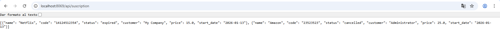

# PR0702: API REST

- `controllers/controllers.py`

```python
# -*- coding: utf-8 -*-
from odoo import http
from odoo.http import request, Response
import json

class SubscriptionController(http.Controller):

    @http.route('/api/suscription', type='http', auth='public', methods=['GET'], csrf=False)
    def get_subscriptions(self, **kw):
        domain = []
        status_param = kw.get('status')

        if status_param:
            valid_statuses = [
                key for key, label in 
                request.env['subscription.subscription'].fields_get(['status'])['status']['selection']
            ]
            
            if status_param not in valid_statuses:
                return Response(
                    json.dumps({
                        "error": "Bad Request",
                        "message": f"El estado '{status_param}' no es válido."
                    }), 
                    status=400, 
                    mimetype='application/json'
                )
            
            domain.append(('status', '=', status_param))

        subscriptions = request.env['subscription.subscription'].sudo().search(domain)

        data = []
        for sub in subscriptions:
            data.append({
                'name': sub.name,
                'code': sub.suscription_code,
                'status': sub.status,
                'customer': sub.customer_id.name if sub.customer_id else None,
                'price': sub.price,
                'start_date': str(sub.start_date) if sub.start_date else None,
            })

        return Response(
            json.dumps(data), 
            status=200, 
            mimetype='application/json'
        )

    @http.route('/api/suscription/<string:name>', type='http', auth='public', methods=['GET'], csrf=False)
    def get_subscription_detail(self, name, **kw):
        sub = request.env['subscription.subscription'].sudo().search([('name', '=', name)], limit=1)

        if not sub:
            return Response(
                json.dumps({'error': 'Not Found', 'message': 'Suscripción no encontrada'}), 
                status=404, 
                mimetype='application/json'
            )

        result = {
            'id': sub.id,
            'name': sub.name,
            'code': sub.suscription_code,
            'customer_id': sub.customer_id.id,
            'customer_name': sub.customer_id.name,
            'status': sub.status,
            'price': sub.price,
            'is_renewable': sub.is_renewable,
            'auto_renewal': sub.auto_renewal,
            'start_date': str(sub.start_date) if sub.start_date else None,
            'end_date': str(sub.end_date) if sub.end_date else None,
            'renewal_date': str(sub.renewal_date) if sub.renewal_date else None,
            'duration_months': sub.duration_months,
            'usage_limit': sub.usage_limit,
            'current_usage': sub.current_usage,
            'use_percent': sub.use_percent,
        }

        return Response(
            json.dumps(result), 
            status=200, 
            mimetype='application/json'
        )
```
